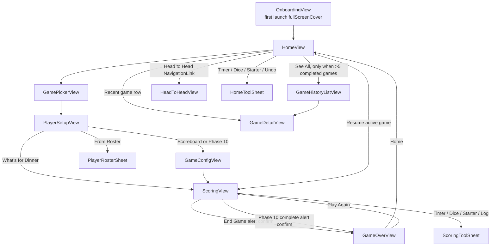

# ScoreKeeper UI Screen Network

Generated for a future Argent Lens redesign pass. This is a route and screen inventory only; it does not propose or implement UI changes.

## Artifacts

- Route-strip manifest: `docs/ui-screen-network-manifest.json`
- Generated route-strip PNG: `docs/ui-screen-network-route-strips.png`
- Source screenshot folder: `screenshots/app-screens`

## Route Backbone

`ContentView` owns the primary `NavigationStack` with `NavigationRouter` and `AppDestination`:

- `HomeView`
- `.gamePicker` -> `GamePickerView`
- `.playerSetup(GameType)` -> `PlayerSetupView`
- `.gameConfig(GameType, [String])` -> `GameConfigView`
- `.scoring(PersistentIdentifier)` -> `ScoringView`
- `.gameOver(PersistentIdentifier)` -> `GameOverView`
- `.gameDetail(PersistentIdentifier)` -> `GameDetailView`
- `.gameHistory` -> `GameHistoryListView`

`HeadToHeadView` is a direct `NavigationLink` from `HomeView`, not an `AppDestination` case. `OnboardingView`, home tools, roster selection, scoring tools, and end-game confirmation are presented as covers, sheets, or alerts.

## Workflow Strips Covered

- New Scoreboard game: Home -> Game Picker -> Player Setup -> Scoreboard Settings -> Scoreboard Scoring -> End Game confirmation -> Game Over.
- New What's for Dinner game: Home -> Game Picker -> Dinner Player Setup -> Dinner Scoring -> End Game confirmation -> Game Over.
- New Phase 10 game: Home -> Game Picker -> Player Setup -> Phase 10 Settings -> Phase 10 Scoring -> End Game or phase-complete confirmation -> Game Over.
- Live scoring tools: Score sheet -> timer, dice, starter, or round-log sheet -> score sheet.
- Resume and replay loops: Home active game -> scoring; Game Over -> Play Again -> scoring; Game Over -> Home.
- Roster reuse: Player Setup -> Roster Sheet -> Player Setup.
- Completed-game review and stats: Home recent games -> Game Details; Home stats -> Head to Head empty, selected, and expanded states.

## Screen Inventory

| Surface | Type | Entry | Exit / Next | Screenshot Coverage |
| --- | --- | --- | --- | --- |
| `OnboardingView` | Full-screen cover | First launch when `hasCompletedOnboarding == false` and not `-in-memory-store` | Continue through pages, Start Keeping Score, or Skip -> Home | Not captured in current screenshot set |
| `HomeView` empty | Root screen | App launch after onboarding or UI tests | New Game, home tools, theme toggle | `01-home.png` |
| `HomeView` active game | Root state | In-progress `GameSession` exists | Resume Game -> Scoring | `16-home-with-active-game.png` |
| `HomeView` recent + stats | Root state | Completed games exist | Recent row -> Game Details; Head to Head -> stats | `17-home-recent-and-stats.png`, `00-current.png` |
| `GamePickerView` | Pushed route | Home New Game | Game tile -> Player Setup | `02-game-picker.png` |
| `PlayerSetupView` | Pushed route | Game Picker tile | Scoreboard/Phase 10 -> Game Settings; Dinner -> Scoring | `03-player-setup-scoreboard.png`, `12-player-setup-whats-for-dinner.png` |
| `PlayerRosterSheet` | Sheet | Player Setup From Roster | Add or Cancel -> Player Setup | `22-roster-select-sheet.png` |
| `GameConfigView` Scoreboard | Pushed route | Scoreboard Player Setup Start | Start -> Scoreboard Scoring | `04-game-settings-scoreboard.png` |
| `GameConfigView` Phase 10 | Pushed route | Phase 10 Player Setup Start | Start -> Phase 10 Scoring | `14-game-settings-phase10.png` |
| `ScoringView` Scoreboard variant | Pushed route | Scoreboard Game Settings, resume, or play again | Submit Round, Undo Last, tool sheets, End Game alert | `05-scoring-scoreboard.png` |
| `ScoringView` What's for Dinner variant | Pushed route | Dinner Player Setup Start | Meal reveal caller, hand values, Submit Meal Reveal, End Game alert | `13-scoring-whats-for-dinner.png` |
| `ScoringView` Phase 10 variant | Pushed route | Phase 10 Game Settings Start | Phase toggles, leftover points, Submit Round, phase-complete alert, End Game alert | `15-scoring-phase10.png` |
| `ScoringToolSheet` timer | Sheet | Scoring toolbar Timer | Done -> Scoring | `06-tool-timer.png` |
| `ScoringToolSheet` dice | Sheet | Scoring toolbar Dice | Done -> Scoring | `07-tool-dice.png` |
| `ScoringToolSheet` starter | Sheet | Scoring toolbar Starter | Done -> Scoring | `08-tool-starter.png` |
| `ScoringToolSheet` log | Sheet | Scoring toolbar Log | Done -> Scoring | `09-tool-log-empty.png` |
| End Game confirmation | Alert | Scoring toolbar End Game | Cancel -> Scoring; End Game -> Game Over | `10-end-game-confirmation.png` |
| Phase 10 complete confirmation | Alert | Phase 10 submit round when `Phase10Engine.isGameOver` | Keep Playing -> Scoring; End Game -> Game Over | Not captured in current screenshot set |
| `GameOverView` | Pushed route | End Game confirmation or Phase 10 complete alert | Play Again -> Scoring; Home -> Home root | `11-game-over-no-winner.png` |
| `GameHistoryListView` | Pushed route | Home See All when more than five completed games | Game row -> Game Details; delete row from list | Not captured in current screenshot set |
| `GameDetailView` | Pushed route | Home recent row or Game History row | Back -> previous list/home | `21-game-details.png` |
| `HeadToHeadView` empty | Direct `NavigationLink` | Home Stats / Head to Head | Pick Player 1 and Player 2 | `18-head-to-head-empty.png` |
| `HeadToHeadView` by game | Direct `NavigationLink` state | Both players selected with shared games | Expand player disclosure | `19-head-to-head-by-game.png` |
| `HeadToHeadView` expanded | Direct `NavigationLink` state | Player disclosure expanded | Collapse or back | `20-head-to-head-expanded.png` |
| Home tool sheets | Sheet | Home Game Night Tools: Timer, Dice, Starter, Undo | Done -> Home | Uses separate `HomeToolSheet`; no dedicated screenshot except scoring-tool analogs |
| `PlayerStatsView` | Defined view, currently no observed route | No `NavigationLink` or `AppDestination` reference found | Back if wired later | Not captured; appears currently unreachable |

## Redesign-Relevant Notes

- `ScoringView` is a shell that switches between `GenericScoringView`, `WhatsForDinnerScoringView`, and `Phase10ScoringView` based on `GameSession.gameType`.
- `ScoringScreenLayout` provides the shared scoring toolbar, score header, undo/submit bottom action bar, and scoring tool sheet loop. The current generic scoring WIP hides the shared scoreboard header with `showsScoreboardHeader: false`.
- `PlayerSetupView` starts Scoreboard and Phase 10 by pushing `GameConfigView`, but starts What's for Dinner by creating a `GameSession` immediately and pushing `ScoringView`.
- `GameHistoryListView` is in the router, but the visible Home "See All" button appears only when `completedGames.count > 5`.
- UI tests run with `-in-memory-store`, which bypasses onboarding and seeds state only through user interactions.
